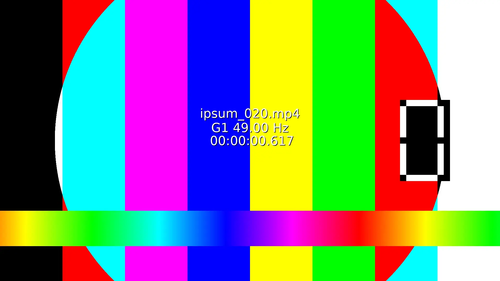

# docsify-videoplayer
Docsify video player is a plugin for Docsify that replace markdown link to video file with a video player

turn 
```
 
```
to 


## Demo 

[docsify-videoplayer-demo](https://gllmar.github.io/docsify-videoplayer/#/)

## tests

### relative links

[relative link](subfolder/)

### thumbnail -> poster
[thumbnail poster](thumbnailposter.md)

* [](./media/ipsum_020.mp4)

### in lists

* 

* 


### in table

|  |  |
|- | -|
|   |   |

### from a drag drop via github web interface

#### Video

Search for url with github and assets, assume mp4 extention if founded. Could lead to problem. 

10 megs max with free account

https://github.com/gllmAR/docsify-videoplayer/assets/7544151/873020c0-9460-4338-a4ae-514af807eb9d

#### Gif 
(unaffected because github put it in a image tag)

```

```


